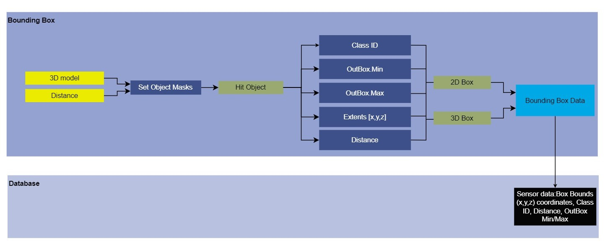

# Module Name
Bounding Box Sensor

## Version

### Developer

## 1. Summary
The Bounding Box Sensor is used to show bounding boxes (2D and 3D) around the selected class of objects presnet in the frame. This sensor first calculates the bounding boxes and then creates a bounding box around each objects on the basis of taking distance and class of object (vehicle, pedestrains, traffic signals, roadside objects, and all of these), alongwith extracting bounding box information from the selected object classes. Extracted information include: frame number, actor ID, class type, center, extends, and distance from the sensor.

Contains two clickable options: 

1. 2D Boxes: Allows two dimeniosnal bounding boxes (rectangular boxes) around the objects
2. 3D Boxes: Allows three dimeniosnal bounding boxes (cuboidial boxes) around the objects

Other Customisable Parameters:

1. Image Dimensions (width x height)
2. Output Location

## 2. Method

The sensor first requires inputs of whether the bounds need to be displayed in 2D boxes or 3D boxes and the maximum distance till which the objects are to be considered drawing bounding boxes. 
First, a mask corresponmding to each of the 29 classes are created {classes are defined in `Annotator.cpp`}, and these are then masked to either "true" and "false" for objects of importance interms of bounding box detections (classes such as Boundary Fencing, Bustand, Tunnels, etc are excluded, i.e. provided a "false" mask as these posses not much significance in terms of bounding boxes on one hand while on the other and classes such as vehicles, pedestrians, etc are masked as "true"). Then, each of the actors belonging to the true masks are fetched for their class information and their box extents are calculated. 

### Data Flow Diagram:
 

### Bounding Box Sensor attributes:

|Input Attributes| Type | Default Value | Description |
| ---------------- | --------------- | ------------------- | --------------- |
| `Distance` | float | 5000 cm | Maximum distance to the objects to be detected by bounding boxes|
| `bIncludeVehicle` | boolean  | false | Boolean that takes input whether the vehicles are to be considered as actors surrounded by bounding boxes|
|`bIncludePedestrians` | boolean | false | Boolean that takes input whether the pedestrians are to be considered as actors surrounded by bounding boxes|
| `bIncludeTrafficSignals` | boolean | false | Boolean that takes input whether the traffic sign board/signals are to be considered as actors surrounded by bounding boxes|
|`bIncludeRoadsideObjects` | boolean | false | Boolean that takes input whether the roadside objects such as traffic cones are to be considered as actors surrounded by bounding boxes|
|`bIncludeAll` | boolean | true | Boolean that makes sure all actors are to be considered for calculating the bounding boxes | 

| Output Attributes | Type | Description |
| ---------------- | ------------------- | --------------- |
|`Id` | int | Unique identifier of the detected actor |
|`OutBox.Min`| FVector | Coordinates of the top left corner of the bounding box|
|`OutBox.Max`| FVector | Coordinates of the bottom left corner of the bounding box |
|`Extends.X`| FVector | X coordinate of the bounding box around an actor |
|`Extends.Y`| FVector | Y coordinate of the bounding box around an actor |
|`Extends.Z`| FVector | Z coordinate of the bounding box around an actor |
|`Distance`| float | Sensor distance from the actor |

### Output:
The box bounds of the detected actor, [x,y,z] coordinates, class ID, distance and whether the detected objects are commpletely inside or outside of the sensor view.

## 3. Requirements
Primary requiremnent: `Annotator.h`.

Calculating the bounding boxes is done by the file "BoundingBoxSensor.cpp", but for visualization (creating boxes over the detected objects in a RGB image) the following files are required:
1. SceneCaptureCamera.cpp
2. SceneCaptureCamera.h

While the `BoundingBoxSensor` itself calculates the bounding box extents, the visulaization of the boxes is performed by the `SceneCaptureSensor` that uses CanvasDrawItem method to draw colored lines corresponding to the class of each object using the box extents generated by the BoundingBoxSensor.