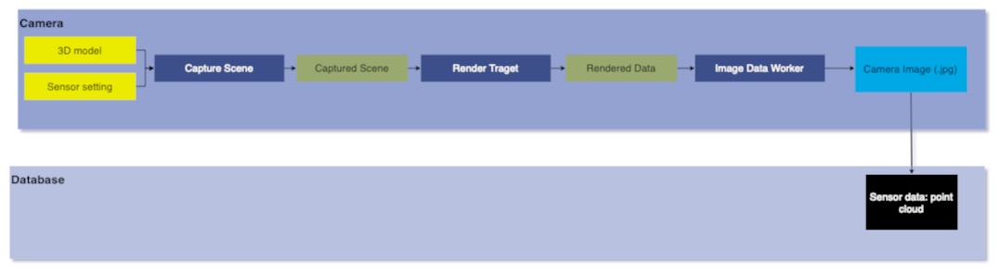

# Module Name
Scene Capture Camera Sensor 
## Version
### Developer

## 1. Summary
The Scene capture camera sensor is designed to capture scenes and generate RGB images in simulation. Along whith RGB image, we can enable 2D and 3D bounding boxes in a captured RGB image. This sensor can apply different post-processing effects for better realism. 

## 2. Method

Initally, a new 2D TextureRenderTarget object is created to render the target texture. The size and format of the pixels for the target texture are initialised according to sensor input, with the texture width and height set to the input `imageWidth` and `imageHeight`, respectively.  Following the initialization of the target texture,the scene is captured using the SceneCaptureComponent provided by unreal engine. The rate at which scene is captured is determined by `1/scanningFrequency`. Once a scene has been captured the RGB color information is extraced by reading the pixels of the target texture. This resulting color data is then send to an image data worker, which convets it into an RGB image in `JPG` format. 

If `bShow2DBounds = true` the camera Sensor draws 2D bounding boxes and when `bShow3DBounds = true` it draws 3D bounding boxes calculated by bounding box sensor. 
For realism, different post-processing effects are applied to the captured image. To enable these effects, bEnablePostProcessingEffects should be set to true. The types of post-processing effects applied are...
1. Lense Flare
2. Bloom
3. Chromatic Aberration
4. Depth of Field
5. Auto Exposure
6. Motion Blur

These effects are provided by Unreal. To known more about these read [Unreal-Postprocessing Effects](https://docs.unrealengine.com/5.3/en-US/post-process-effects-in-unreal-engine). 
The data flow of camera sensor is shown below-

### Camera attributes

| Input attribute  | Type   | Default    | Description     |
| ----------------------------------------------------------------- | ----------------------------------------------------------------- | ----------------------------------------------------------------- | ----------------------------------------------------------------- |
| `imageWidth` | int    | 640 | Image width in pixels   |
| `imageHeight`         | int    | 480     | Image width in pixels   |
| `scanningFrequency`| int  | 10 | Capturing frequency of camera in Hz.       |
| `bShow2DBounds`            | bool  | false  | Whether to show 2D Bounding boxes in captured image.      |
| `bShow3DBounds`            | bool  | false | Whether to show 3D Bounding boxes in captured image.   |
| `bShowOccludedObjects`        | bool  | false | Whether to show Bounding boxes for occluded objects.           |
| `bEnablePostProcessingEffects`        | bool  | false | Enable post-processing effects.        |
| `targetGamma`     | float  | 2.2 |Target gamma value of the camera. |
| `fovAngle`     | float  | 46.0   | Horizontal field of view in degrees. |
| `shutterSpeed`     | float  | 1/80.0   |The camera shutter speed in seconds. |
| `ISO`     | float  | 200  | The camera sensor sensitivity. |
| `fstop`     | float  | 1.4   | Opening of the camera lens. Aperture is 1/fstop with typical lens going down to f/1.2 (larger opening). Larger numbers will reduce the Depth of Field effect. |
| `FocalDistance`     | float  | 1000  | Distance at which the depth of field effect should be sharp. Measured in cm (UE units). |

### Post-Processing attributes

| Input attribute  | Type   | Default    | Description     |
| ----------------------------------------------------------------- | ----------------------------------------------------------------- | ----------------------------------------------------------------- | ----------------------------------------------------------------- |
| `bEnableDepthBlur` | bool    | false  |   To enable Depth Blur (Depth of Field) post-process effect.   |
| `depthBlurBladeCount` | int    | 5  | The number of blades of the diaphragm within the lens between [4,16].    |
| `depthBlurAmount` | float    | 1.0  | Depth blur km for 50%    |
| `depthBlurRadius` | float    | 0.0  | Depth blur radius in pixels at 1920x    |
| `depthBlurMinFStop` | float    | 1.2  | the maximum opening of the camera lens to control the curvature of blades of the diaphragm.   |
| `lensFlareIntensity` | flaot    | 0.1  | Intensity for the lens flare post-process effect, 0.0 for disabling it.    |
| `lensFlareThreshold` | float    | 0.1  | Minimum brightness the lens flare starts having effect.   |
| `lensFlareBokehSize` | float    | 8.0  | Size of the lens blur (in percent of the view width) that is done with the Bokeh texture.    |
| `motionBlurIntensity`         | float   | 0.45     | Strength of motion blur [0,1].  0.0 for disabling it.|
| `motionBlurMaxDistortion`| float  | 0.35 |Max distortion caused by motion blur. Percentage of screen width. 0.0 for disabling it.       |
| `motionBlurPerObjectSize` | float    | 0.1 | The minimum projected screen radius for a primitive to be drawn in the velocity pass for motion blur consideration. The radius is a percentage of screen width.    |
| `motionBlurTargetFPS` | int    | 0  | Defines the target frames per second (fps) for motion blur. 0 to make motion blur dependent on the actual measured frame rate.   |
| `bloomThreshold` | float    | -1  | Minimum luminance the bloom starts having effect.    |
| `bloomIntensity` | float    | 0.67  | Intensity for the bloom post-process effect, 0.0 for disabling it.    |
| `bEnableChromaticAberration`            | bool  | 10000.0  | To enable Chromatic Aberration post-process effect.      |
| `ChromaticAberrationIntensity`            | float  | 0.0  | Scaling factor to control color shifting, more noticeable on the screen borders.  |
| `ChromaticAberrationOffset`        | float  | 0.0 | Normalized distance to the center of the image where the effect takes place.        |

### Output attributes

Captured RGB image of provided height and width in `jpg` format.

## 3. Requirements
Unreal 
