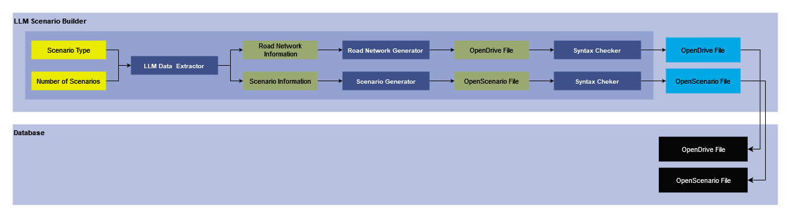

# LLM Scenario Builder

## Version 1.0

### Developer: Meet Maratha

> _NOTE:_ This is a test repository and there may be some errors present. The user should be well versed in coding and be able to handle them.

## 1. Task List 
- [x] Check which LLM's can be used for this purpose and how do they fare in comparision to each other.
- [x] Generate a list of prompts that can be used for LLM's to generate a condensed scenario data.
- [x] Display a method we can use to generate scenarios from the scenario data provided by LLM's using scenariogeneration module.
- [x] Create a basic pipeline that can be made more robust in the future to generate more scenarios.
- [x] Integration with Permutation and Combination module.
- [ ] To update the README/User guide.
- [ ] Choose the LLM that we will be using to generate scenarios.
- [ ] A parser to parse the output from the LLM into a standard format which we can save at a location to be used in future.
- [ ] A parser to parse the stored standard format of scenario description in a text file and generate a python dictionary from it.
- [ ] Make the scenario generation methods more robust to handle edge scenarios and not produce errors as much as possible.
- [ ] Profile the code and try to optimize it.

## 2. Summary

This module is responsible for generation of [OpenScenario](https://www.asam.net/standards/detail/openscenario-xml/) files with the help of Large Language Models (LLMs) such as [ChatGPT](https://chat.openai.com/) and [GoogleGemini](https://gemini.google.com/app). In this pipeline we decide the type of scenario to be generated and then use LLMs API prompting to get relevant information about the scenario and the environment. We then use our method to generate the road network, which is stored as [OpenDrive](https://www.asam.net/standards/detail/opendrive/) file and scenario description that is stored as an OpenScenario 1.2.0. 

To get information about the scenario and environment through LLM we use our proprietary solution that ensures reliable and accurate files. This proprietary solution consits of data generation, validation, and error free output file generation. 

This module uses OpenScenario 1.2.0 as its output format for the scenario. Before saving the scenario in database we perform a syntax check on it to ensure that there is no error in the generate OpenScenario file. We can use this generated OpenScenario file defining the maneuver in combination with our [Variation Engine](VariationEngine.md) which can perform Permutation and Combination to generate variations of this base scenario to provide you bulk of OpenScenario files for one/collection of Base scenario(s).

## 3. Method


### 3.1 Inputs
- **Scenario Type:** The type of scenario that has to be generated.
- **Number of Scenarios:** The number of scenarios that we need as output. 

### 3.2 LLM Data Extractor
- This is our proprietary module that uses the inputs to generate a compressed, reliable, and valid datastructure that we can use to generate OpenDrive and OpenScenario files.

### 3.3 Road Network Information
- This is a datastructure that stores information about the road network which we can use to generate OpenDrive file.

### 3.4 Scenario Information
- This stores information about the vehicles, objects, and their interaction in a datastructure that can be used to generate OpenScenario files.

### 3.5 Road Network Generator
- This module takes the road network information generated using LLM Data Extractor and prepares a cohesive OpenDrive file with all the roads, their connections, and roadside objects.

### 3.6 Scenario Generator
- This takes the scenario information generated by LLM Data Extractor and generates an OpenScenario file that has all the vehicles, objects, pedestrians, and thier interactions.

### 3.7 Syntax Checker
- This takes input as OpenDrive or OpenScenario file and checks for any syntax error.
- If it finds a syntax error in one of these files, it drops both of them and moves on to other processes.

### 3.8 Output
- **OpenDrive File:** This is the final OpenDrive file which has been generated using LLM Scenario Builder.
- **OpenScenario File:** This is the final OpenScenario file which has been generated using LLM Scenario Builder.
- Both of these files are stored in database for further computation on them.

## 4. Requirement
1. Installed Python version 3.10
2. ScenarioGeneration Python package.
3. LLM API key

## 4. How-to-guide

1. Install python version 3.10

2. Open a command prompt (cmd) or terminal on your system.

**For Windows:**
- Open the folder in file explorer where you want to clone the repository
- Click on the white space after the path which is displayed in file explorer.
    


- Remove the path and type cmd instead of it, and click enter.


- This will open the command prompt window.

**For Linux:**
- Open the terminal as you would normally do in your system.

3. Clone the github repository using the following command

```
git clone https://github.com/MeetMaratha/ScenarioGeneration-Test.git
```

4. Change direcotries to the cloned repository using following commands:

```
cd ScenarioGeneration-Test
```

5. Make a virtual environment to work. This is only needed to separate the project from the main system install. You can use the following command in the cloned github folder to generate the virtual environment 

**For Windows and Linux distributions other than Ubuntu/Debian:**
```
python -m venv sg_venv
```
**For Ubuntu/Debian use following command:**
```
python3 -m venv sg_venv
```

6. Activate the virtual environment using the following command in the cloned github folder

**For Bash/ZSH shell:**
```
source sg_ven/bin/activate
```
**For Windows Command Prompt/Powershell/Windows Terminal:**
```
sg_venv\Scripts\activate
```
**For Fish shell:**
```
source sg_venv/bin/activate.fish
```

7. Install the python packages required using the following command
```
pip install -r requirements.txt
```

## 5. Tutorial

1. Use the following prompt to generate 20 scenarios of any scenario type using one of the suggested LLM's. We used a place holder **\[Scenario Name]** here, remember to replace it with valid value.
```
Act as a scenario writer. Generate 20 different [Scenario Name] scenario that I can use as a base and use permutations and combinations to generate multiple scenarios from it. Format the output as a list of paragraphs.
```
2. Now choose one of the scenarios from the output and generate a xodr data dictionary for it using the LLM and the following prompt. Place the scenario description you have choosen where there is a place holder **\[Scenario Description]**
```
profile picture
Generate a structured dictionary data for the following scenario. The comments in "()" are somethings that I need you to pay extra attention to:
"
[Scenario Description]
"
Fill the values for each of these tags (need to be numerical). Following tags should be present compulsorily and they should be presented in the following structure:
1. Number of roads (calculate it properly)
2. Number of lanes in each road (calculate it properly)
3. Number of junctions (Do not put unnecessary junctions in the network, if there are more than 3 roads then only a junction can be formed, so check whether that is the case or not based on the description)
4. Road Information
    a. Lane Information
        i. Length of lane
        ii. Direction of driving (calculate it properly, based on the description, +1 or -1 representing left and right driving respectively)
        iii. Width of lane
        iv. Id of lane
    b. Predecessor and Successor of roads (calculate it properly, if there are any. Neighboring roads are not predecessor and successors. Also notify the first road in the road network, which would not have any predecessor with -1)
    c. Name of the road
    d. Angle of the road (If there is a junction)

If you could, provide an image that I can use to understand how road network should look like. Format the output as python dictionary.
```
3. Now try to generate a XOSC data description using the LLM for the chosen scenario using the following prompt. Similar to the previous step copy the scenario description where there is a place holder **\[Scenario Description]**
```
Generate a structured dictionary data for the following scenario. The comments in "()" are somethings that I need you to pay extra attention to:
"
[Scenario Description]
"
Fill the values for each of these tags (need to be numerical). Following tags should be present compulsorily and they should be presented in the following structure:
1. Number of Entities (Based on previoius response)
2. Information of entities (Based on previous response for each entity)
    a. Name of Entity
    b. Dimensions of Entity (Length, Width, Height)
    c. Displacement in X along a lane of the road
    d. Action associated to this entity
        i. Name of the action
        ii. Trigger for the action (Keep this as time)
        iii. When does the action occur?
        iv. How long does the action occur?
        v. If there is a lane/road change due to this action, specify it 
    e. Initial speed of the vehicle
3. Weather

Format the output as python dictionary
```
4. Now make a copy of any of the files in the Input folder and replace/add the values as necessary. This is currently a manual task but would automated in future. You can use the following command to make the copy (We suggest you use this command and while using it be in the root directory of the repository)

**For Linux systems:**
```
cp Inputs/Test_CI_1.py Inputs/New_File.py
```
 **For Windows system:**
```
copy "Inputs\Test_CI_1.py" "Inputs\New_File.py"
```

This commands will generate a python file that you will need to update in the `Inputs` folder and the file would be called `New_File.py`

5. Rename the file according to the type of the scenario description. This is the only labeling of file that will help you seperate it from others, so do it correctly.

We recommend the following naming: `Test_{Type of Scenario in Abbreviation}_{Next Number of file}.py`
We recommend the following abbreviations

| Type               | Abbreviation  |
| ------------------ | ------------- |
| Lane Change        | LC            |
| Left Turn          | LT            |
| Right Turn         | RT            |
| Cut-in             | CI            |
| Cut-out            | CO            |
|Left turn/Right Turn| LT_RT         |

5. Now manually edit the python script saved and add the information to the `custom_parameters` python dictionary. Add the things to the relevant places as mentioned using the comments.

6. Once you are satisfied with your editing, run the `main.py` file using the following commands:

**For Windows and Linux distributions other than Ubuntu/Debian:**
```
python main.py
```
**For Ubuntu/Debian use following command:**
```
python3 main.py
```

7. This will launch an interactive shell where you can choose the file for which you want to generate scenario and realizations.

8. Once it is done, the outputs will be stored in the `Outputs` folder. Following subfolders will have following outputs:
    - **XODR:** The XODR files generated for your choice.
    - **XOSC:** The XOSC files generated for your choice.
    - **Realizations:** The permutation and combination of your generated XOSC file will be stored in it inside a folder for each scenario. The folder name is based on the name of the input python file. 