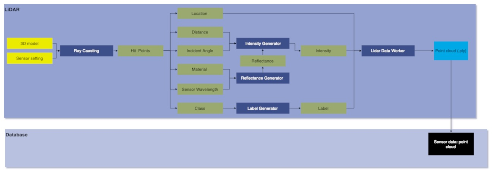

# Module Name
Rotating LIDAR Sensor 
## Version
### Developer

## 1. Summary
The Lidar sensor is designed to simulate a rotating LIDAR sensor using ray-casting . It utilizes Lidar parameters such as pluse repetation frequency, scanning frequency, field of view, and range to generate a point cloud output. The resulting point cloud contains location, time, distance, intensity, label and scan angle information in `ply` format. The sensor design incorporates multithreading for optimization.

## 2. Method

To simulate the rotating Lidar sensor, the sensor is first initiallised by computing vertical angle for each channel/laser within the Vertical FOV. After that, the no. of fires per scan and per second is calculatd using `FiresPerScan = SensorParameters.Prf / SensorParameters.ScanningFrequency / SensorParameters.Channels` and `FiresPerSec = FiresPerScan * SensorParameters.ScanningFrequency`. To ensure that the fires per second remain consistant and independent of simulation's FPS they are multiplited by `1/FPS` resulting in `FiresPerSec = FiresPerScan * SensorParameters.ScanningFrequency * (1/FPS)`. Ray-casting is then performed in parallel for each channel/laser to increase efficiency and decrease computation time. \
The point cloud obtained from ray-casting contains information about the hit point's **location** (in xyz), **time** , **distance**, **intensity**, **label** and **scan angle**.

The intensity of hit point is calculate using the formulae:

$ I_{\text{return}} = I_{\text{emit}} \times R_{\text{rel}} \times \cos \theta \times \exp(-\sigma_{\text{air}} \times D) $

Where $ I_{\text{return}}$ is the intensity of the retuened laser pulse, $ I_{\text{emit}} $ is the intensity of the emitted laser pulse, $ R_{\text{rel}} $ denotes the reflectivity of the surface material, $ \cos \theta $ is the reflection rate w.r.t angle of incidence $ \theta $ and $ \exp(-\sigma_{\text{air}} \times D) $  is the atmosphere attenuation rate,  $ \sigma_{\text{air}} $ is atmosphere attenuation rate cofficient and $ D $ is distance of hit point form Lidar. 

The reflectance of material is stored in `reflectance.txt` file at four different wavelengths refered from  Spectral Libraray provided by U.S Geological Survey. The reflectance file looks like this-
<figure>
  
</figure>

The reflectance file contains three columns: the first column lists the material name, the second column denotes the wavelength (in micrometers), and the third and final column displays the reflectance percentage corresponding to each wavelength.

The label of hit point is its semantic tag mapped with the class. The class-tag mapping with semantic color is shown below-
| Tag | Class              | Color                |
|----|--------------------|----------------------|
| 1  | BoundaryFencing    | FColor{112, 160, 160}| 
| 2  | Buildings          | FColor{116, 116, 116}|
| 3  | BusStand           | FColor{207, 207, 111}|
| 4  | Decals             | FColor{178, 139, 66} |
| 5  | Fences             | FColor{153, 153, 187}|
| 6  | Pedestrians        | FColor{228, 79, 109} |
| 7  | Props              | FColor{234, 175, 2}  |
| 8  | RailTrack          | FColor{230, 150, 140}|
| 9  | RoadLaneMarkings   | FColor{196, 199, 198}|
| 10 | RoadMeshes         | FColor{160, 112, 160}|
| 11 | RoadsideFurniture  | FColor{220, 151, 245}|
| 12 | SideWalk           | FColor{246, 90, 236} |
| 13 | StreetLights       | FColor{178, 178, 178}|
| 14 | Terrain            | FColor{178, 252, 177}|
| 15 | TrafficSigns       | FColor{229, 227, 64} |
| 16 | TransmissionTower  | FColor{178, 178, 178}|
| 17 | Vegetation         | FColor{145, 170, 89} |
| 18 | Vehicles           | FColor{63, 64, 170}  |
| 19 | TrafficLights      | FColor{181, 235, 231}|
| 20 | SmallPole          | FColor{178, 178, 178}|
| 21 | Sky                | FColor{116, 162, 198}|
| 22 | Rider              | FColor{254, 64, 66}  |
| 23 | Truck              | FColor{64, 64, 116}  |
| 24 | Bus                | FColor{64, 109, 140} |
| 25 | Train              | FColor{65, 124, 140} |
| 26 | Motorcycle         | FColor{64, 64, 236}  |
| 27 | Bicycle            | FColor{153, 72, 87}  |
| 28 | Bridge             | FColor{175, 139, 139}|
| 29 | Tunnel             | FColor{178, 153, 131}|

To obtain better realism random noise with `stdDev=0.005` has been added to the hit points.\\ 
The resulted point cloud is passed to class `LidarDataWorker` to write the output in a `.ply` file. The writing process of data happens parallel to ray-casting in background.   
The data flow of Lidar sensor is shown below- 

### Lidar attributes

| Input attribute  | Type   | Default    | Description     |
| ----------------------------------------------------------------- | ----------------------------------------------------------------- | ----------------------------------------------------------------- | ----------------------------------------------------------------- |
| `prf` | int    | 500000  | Pulse Repetition Frequency: No. of points generated by all lasers per second.    |
| `channels`         | int    | 64     | Number of lasers.  |
| `scanningFrequency`| int  | 1 | Liadr scanning frequency in Hz.       |
| `maxRange`            | float  | 10000.0  | Maximum distance at which a point can be detected by the Lidar sensor (in cm).      |
| `minRange`            | float  | 0.0  | Minimum distance at which a point can be detected by the Lidar sensor (in cm).  |
| `negVerticalFOV`        | float  | -25.0 | Angle in degrees of the lowest laser.         |
| `posVerticalFOV`        | float  | 15.0  | Angle in degrees of the highest laser.        |
| `atmosphereAttenuationRate`     | float  | 0.004 | Coefficient that measures the LIDAR instensity loss per meter, |
| `wavelength`     | float  | 1.4   | Wavelength at which Lidar sensor operates (in micrometer). |

### Output attributes

| Sensor data attribute            | Type  | Description        |
| ----------------------- | ----------------------- | ----------------------- |
| `x`            | float   | X coordinate of hit point.                      |
| `y`            | float  | Y coordinate of hit point.       |
| `z`            | float   | Z coordinate of hit point.       |
| `intenstity`            | float   | Intensity of the reflected leaser from the hit point.               |
| `time`        | float| Simulation time of the measurement in seconds since the beginning of the episode.        |
| `label`        | uint | Label of hit point (see class-label mapping). |
| `r`   | uint | red value of the color of label.              |
| `g`         | uint  |  green value of the color of label.    |
| `b`       | uint  |  blue value of the color of label.  |
| `scan_angle`         | float | Horizontal angle of the hit point.      |
| `distance`         | float| Distance of hit point from  Lidar sensor (im cm).          |

## 3. Requirements
1. Unreal Engine 
