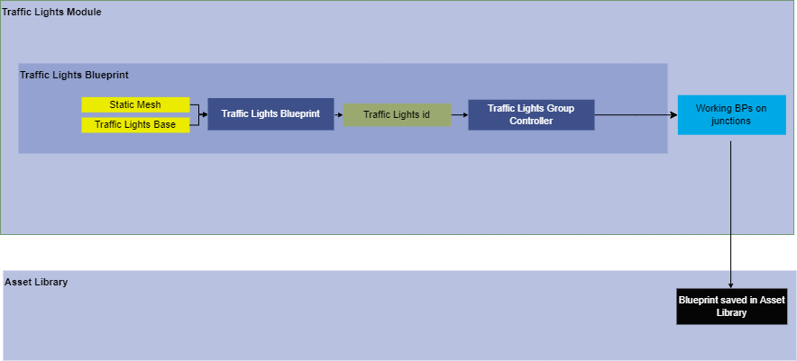
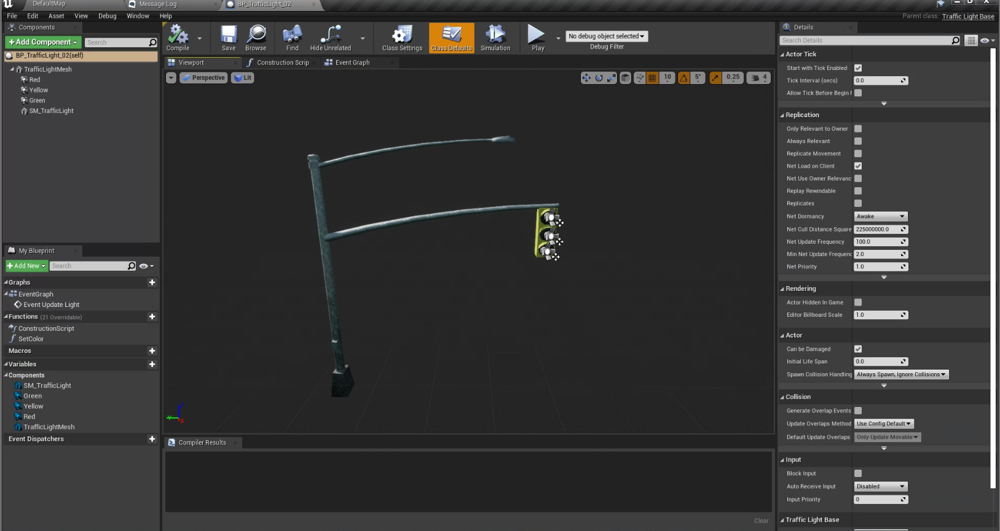
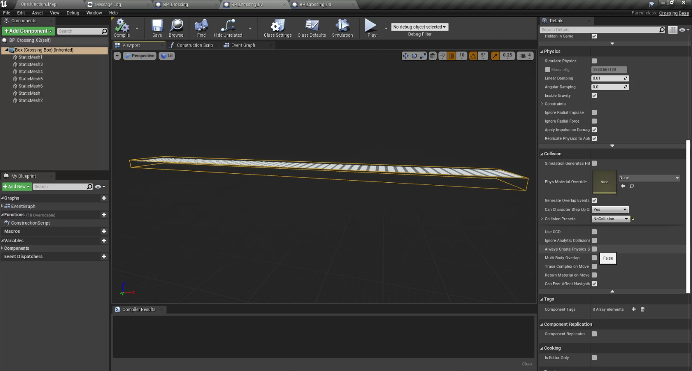
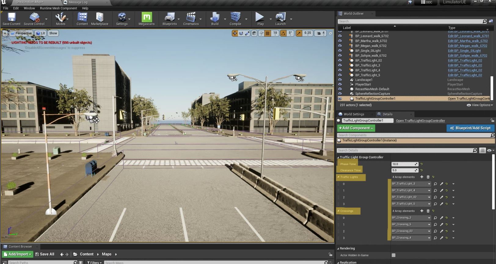
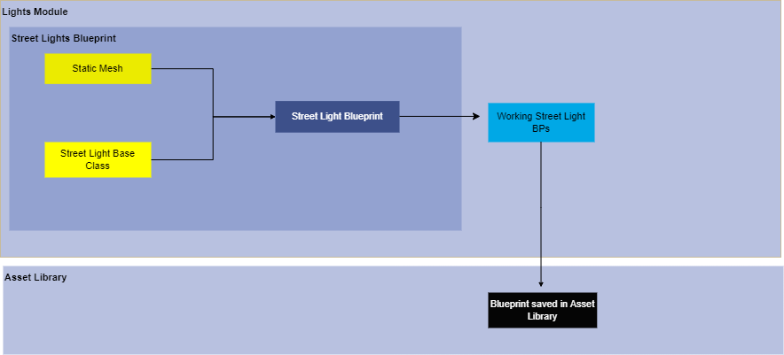
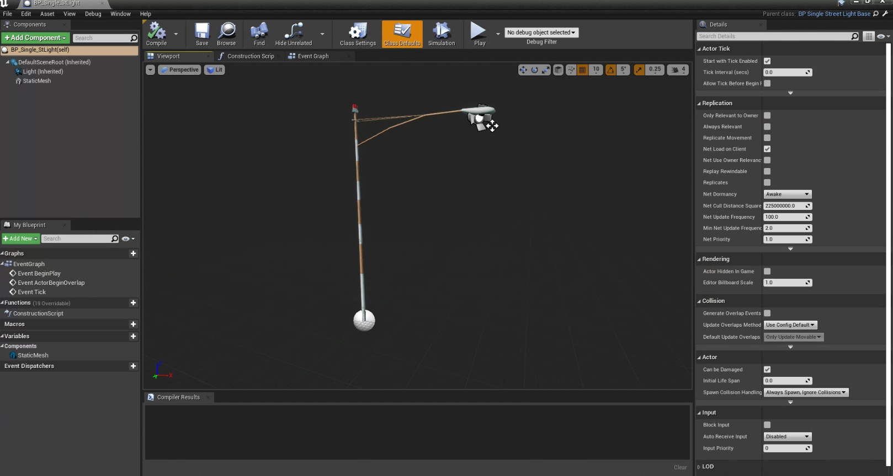

# Traffic Lights
## Version 1.0
### Modeler - Manasvi Kale

## 1. Summary
This document helps you create a traffic lights blueprint which is in alignment with traffic lights controller, during the Simulation vehicles and pedestrians will only follow the traffic lights created by these specifications in our simulator.

## 2. Method
A blueprint deriving from traffic lights base class is created which inherits light controlling properties and functions of the base class. This Blueprint is then further given to controller for realistic working of traffic light at a junction in environment. 

Refer How-to-guide to set up other independent compoents required for working of traffic lights.

flowchart - 

## 3. Requirements
1. Static Mesh of Traffic Light
2. Relevant materials for light mesh
3. Trafficlights base class
4. Traffic Lights Group Controller 
5. Crosswalk blueprints

      5.1. 3D asset of crosswalk

      5.2. Material Blueprints 

      5.3. Crosswalk base class

## 4. How-to-guide

### 4.1 Step 1 - Creating Traffic Light Blueprint

1. Step 1 - Create / Import static mesh for traffic lights.
2. Step 2 - Create a Blueprint in the folder content>blueprints>lights.
3. Step 3 - Inherit a new blueprint from the “trafficlightbase” class.
4. Step 4 - Add static mesh in the new BP. 
5. Step 5 - Set lights and default intensity to 0.
6. Step 6 - Apply and save BP

### 4.2 Step 1 -  Creating Crosswalks Blueprint 

1. Step 1 - Create/Import a static mesh for crosswalks.
2. Step 2 - Create a new BP for crosswalks and inherit it from the CrossingBase class.
3. Step 3 - Import static mesh for crosswalks in BP and place it inside the box.
4. Step 4 - Set collision presets for the box as “no collision”
5. Step 5 - Set collision presets for all crosswalks static meshes used as “no collision”
6. Step 6 - Apply and save 

### 4.3 Step 3 -  Traffic Lights Group Controller
1. Step 1 - Place traffic lights group controller anywhere in the map.
2. Step 2 - Set phase time and clearance time for the lights. 
3. Step 3 - Add the number array elements as no. of lights present in the map.
4. Step 4 - Add the crosswalk array elements as no. of crosswalks in the map.
5. Step 5 - Select the BP of traffic lights in the order you want them to run.
6. Step 6 - For each traffic light add the respective crosswalk in the crosswalk array elements. Ensure the order of traffic lights and the order of their crosswalk should match.
7. Step 7 - Save the map and perform trail runs to ensure correct working of lights and crosswalks.

**** 

# Street Lights
## Version 1 

## 1. Summary
This document aims to create a dynamic Street lights blueprints which will turn on only when the simulation is happening in evening or in night mode and turns off autonatically otherwise.  

## 2. Method
A blueprint deriving from street lights base class is created which inherits light controlling properties and functions of the base class. The street lights blueprints are of two types.

 - Single Street Light
 - Double Street Light

flowchart - 

## 3. Requirements
1. Street Light 3D model
2. Material blueprints for street light
3. lights base classes
  3.1 single street light base class
  3.2 double street light base class 

## 4. How-to-guide

####  Step 1 - Create / Import static mesh for steet lights.
####  Step 2 - Create a Blueprint in the folder content>blueprints>lights.
####  Step 3 - Inherit a new blueprint from the “singlestreetlightbase” class.
####  Step 4 - Add static mesh in the new BP. 
####  Step 5 - Set lights and default intensity to 0.
####  Step 6 - Apply and save BP

- The procedure to create street light blueprint from double street light base class is same. The base class changes to "DoubleStrteetLights" base class. 

## 5. Tutorial

****

