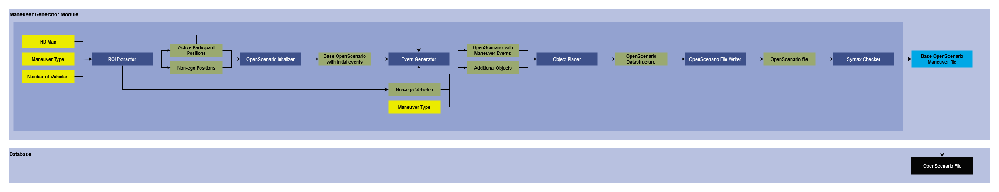

# Manuever Generator

## Version 1.0

### Developer: Meet Maratha

## 1. Summary
This module is responsible for generation of [OpenScenario](https://www.asam.net/standards/detail/openscenario-xml/) files using [OpenDrive](https://www.asam.net/standards/detail/opendrive/) (XODR) map, Maneuver type, and the number of Vehicles as its input. The OpenDrive map can either be provided by the user, or can be generated using our module for OpenDrive file generator based on real-world [OpenStreetMap](https://www.openstreetmap.org/) (OSM) called [OSM2XODR](OSM2XODR.md). These scenarios are generated around an Ego vehicle, which is basically the vehicle that is performing the maneuver. In it we compute relevant Region Of Interests (ROIs) for Ego vehicle, Helper vehicles, Non-ego vehicles, and additional objects and place them accordingly on the map. 

Based on the maneuver type we may require to control some other vehicles to garuntee that the maneuver happens, we rightfully call them Helper vehicles. The vehicles other than Ego vehicle and Helper Vehicles are classified as Non-ego vehicles. These vehicles do not directly take part in the maneuver but help to populate the environment. For some maneuvers such as Barricade maneuver, we require some barriers to be placed on the road. These are the additional objects which place based on the need of the maneuver. To each dynamic object in the maneuver we assign their relevant actions which they need to perform for generating the maneuver. 

This module uses OpenScenario 1.2.0 as its output format for the scenario. Before saving the scenario in database we perform a syntax check on it to ensure that there is no error in the generate OpenScenario file. We can use this generated OpenScenario file defining the maneuver in combination with our [Variation Engine](VariationEngine.md) which can perform Permutation and Combination to generate variations of this base scenario to provide you bulk of OpenScenario files for one/collection of Base scenario(s).

## 2. Method

### 2.1 Inputs
- **HD Map:** This is the Road network on which we wish to generate the Scenario
- **Maneuver Type:** This is the type of maneuver we wish to generate. This is selected based on available maneuver types. Following maneuver types are available:
    - Speeding
    - Braking
    - Lane Change
    - Cut-in
    - Cut-out
    - Overtake
    - Low Fuel
    - Parking
    - Pedestrian Crossing
    - Emergency Vehicle Pass
    - Barricade
- **Number of Vehicles:** This is the number of vehicles in the scenario including the Ego vehicle.

### 2.2 ROI Extractor
- Based on the HD Map and Maneuver type it first checks if the selected maneuver can be performed for this HD Map. If it cannot generate the maneuver on this map, it notifies the user and moves onto to another HD Map if available.
- If it can generate the maneuver on the provided HD Map, it extract spawn points for the Ego vehicle which can ensure that the maneuver occurs.
- It then checks if there is a need for Helper vehicles. As explained in the [summary](#1-summary) Helper vehicles are vehicles that help Ego vehicle to perform a certain type of maneuver.
- If there are Helper vehicles needed, it finds their possible spawn points based on the Ego vehicle position.
- After computation of all these, it computes spawn points for Non-ego vehicles. As defined in the [summary](#1-summary) these are vehicles that help generate environment beside the Ego vehicle.
- For their positions we find spawn points around Ego vehicle in a circle of radius of 300 meters.
- After it has generated these spawn points it provides us with python generator functions for each of these cases which we then attach to specific vehicles.
- We use all these ROIs till we reach the maximum number of files required.
- We assume an ROI has been used completely used when we have exhausted all the possibilities for Non-ego vehicle spawn points.

### 2.3 Ego position
- This is one of the ego position that has been chosen from the list of possible spawn points for the Ego vehicle based on the Maneuver type and the HD Map.

### 2.4 Helper position
- This is one of the helper position that has been chosen from the list of possible spawn points for the Helper vehicle based on the Maneuver type, HD Map, and Ego position.

### 2.5 Non-ego positions
- This is a list of required Non-ego positions based on the number of vehicles, Ego position, and HD Map provided as input. It is chosen from the complete list of possible Non-ego positions based on the Maneuver type, HD Map, and Ego position.

### 2.6 OpenScenario Initalizer
- This initalizes a basic OpenScenario file.
- For this we first place all the vehicles based on the Ego position, Helper position and Non-ego positions.
- After this we assign speed for Ego and Non-ego vehicles.
- We compute the speed of Helper vehicle based on the speed of Ego vehicle and maneuver type.

### 2.7 Base OpenScenario with Initial events
- Anything that happens in an OpenScenario file is called an event.
- We get a basic OpenScenario file at this stage which has all the initial events and vehicles in it.

### 2.8 Event Generator
- **Inputs:**
    - Base OpenScenario file with Initial events
    - Ego position
    - Helper position
    - Non-ego vehicles
    - Maneuver type
- In it we generate all the the additional events that are necessary for this maneuver to be performed.
- All this updation is performed on the Base OpenScenario file with Initial events.
- We require Ego position and Helper position to generate maneuver events.
- We require Non-ego vehicles to specify any special events that might need to happen when Ego vehicle interacts with them.
- We require Maneuver type to define the event that needs to be generated using Ego and Helper vehicle.

### 2.9 OpenScenario with Maneuver events
- At this stage we have an OpenScenario file with all the events defined.

### 2.10 Additional objects
- These are the additional objects that neeeds to be placed in the environment for a certain maneuver to be performed.
- For example, to complete the barriaced maneuver, we need barricade to be placed on the lane on which Ego vehicle is travelling.

### 2.11 Object Placer
- This places all the required objects in the OpenScenario file.

### 2.12 OpenScenario Datastructure
- This is the OpenScenario datastructure that is ready for writing to a file.

### 2.13 OpenScenario File Writer
- This module writes the OpenScenario datastrucure in OpenScenario 1.2.0 file format.

### 2.14 OpenScenario File
- This is the final OpenScenario file that performs the selected maneuver on the specified HD Map.

### 2.15 Syntax Checker
- This module checks for any error in the syntax of the generated OpenScenario file.
- If there is some error in the generated OpenScenario file, it deletes that file and moves on to another process.

### 2.16 Output
- Our output is the base scenario maneuver file which will perform a specified maneuver on the selected HD map when it is ran.
- It is stored in the database for performing some other computations based on this file.

## Requirement
1. Installed Python version 3.10
2. ScenarioGeneration Python package.