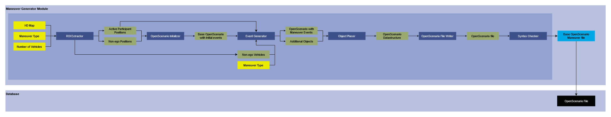

# OSM2XODR

## Version 1.0

### Developer: Meet Maratha

## 1. Summary
### Needs updating
This module is responsible for generation of a type of HD Map called [OpenDrive](https://www.asam.net/standards/detail/opendrive/) (XODR) file based on real-world [OpenStreetMap](https://www.openstreetmap.org/) (OSM) data. This is used in tandem with our other modules to generate scenarios and sensor data for those scenarios. One of our module that can benefits a lot from this module is [Maneuver Generator](ManeuverGenerator.md) that uses an OpenDrive file with some other inputs to generate scenarios performing certain type of maneuver. It can also be used with our [Traffic Manager](TrafficManager.md) module which can generate traffic on this generated OpenDrive file for generating sensor data.

The inputs to this module is a text (.txt) file which consists of extents on OSM highlighting the required region. This required region is downloaded and road information such as road network and roadside objects are extracted from this OSM to generate OpenDrive file. After this OpenDrive file is generated a check is performed on it to verify if there is no syntax error in the file.

## 2. Method

### Needs updating
### 2.1 Inputs
- **OSM Extents:** This is a text file which contains extents of the regions we need to generate OpenDrive file for, from OpenStreetMap.

### 2.2 Extent Loader
- This reads the input text file and stores them as a list.

### 2.3 List of All extents
- This is a list of all the extents stored in software to be processed.

### 2.4 OpenStreetMap Downloader
- This processess each of the extent serially and downloads the respective OSM using wget.
- It stores the downloaded OSM in the relevant folder

### 2.5 OpenStreetMaps
- These are the downloaded OSMs.

### 2.6 Road Network Extractor
- This extracts and extrapolates road network such that we can create an OpenDrive map.
- To do this it makes use of Nodes and Ways in OSM, and extrapolates connections and geometry.
- This information is stored as a data structure

### 2.7 Road Network
- The data structure that holds information about all the roads in the road network.
- This is used to generate the OpenDrive file in further steps.

### 2.8 Roadside Objects Extractor
- **Inputs:**
    - Road Network
    - OpenStreetMap
- This uses the data in OSM to find road side objects such as traffic signal, signs, and zebra crossings in the network.
- It then uses Road Network to compute the local co-ordinate for these objects based on the road they are attached.

### 2.9 Roadside objects
- These are the local co-ordinate position for the roadside objects that is computed from OSM data.

### 2.10 OpenDrive Writer
-  **Inputs:**
    - Road Network
    - Roadside Objects
- This writes the OpenDrive file based on the Road Network data structure and Roadside objects.

### 2.11 OpenDrive Maps
- This the generated OpenDrive file that is stored in the default folder.

### 2.12 Syntax Checker
- This module checks for any error in the syntax of the generated OpenDrive file.
- If there is some error in the generated OpenDrive file, it deletes that file and moves on to another process.

### 2.16 Output
- Our output is the OpenDrive file generated for the OSM extent.
- It is stored in the database for performing some other computations based on this file.

## Requirement
- Installed Python version 3.10
- osmread package.
- Installed wget