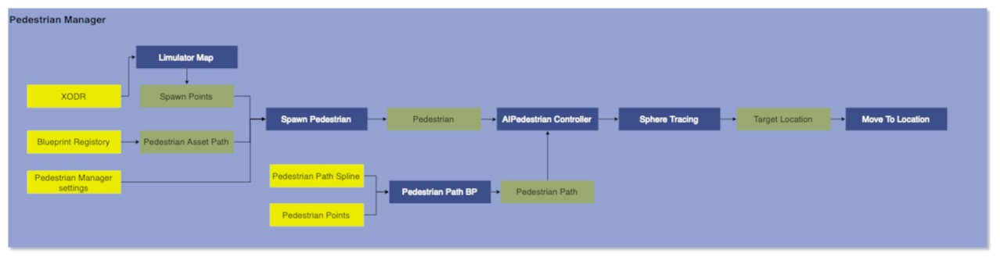

# Pedestrian Manager
## Version
### Developer

## 1. Summary
This module is designed to control the pedestrians in simulation. This module controls the movement of pedestrian and ensues that they only move in pedestrian area. 

## 2. Method
At the beginning of the simulation, spawn points are calculated for pedestrians. After generating these spawn points, a random point is selected on the navigational mesh within a radius of 5m around each spawn point. Pedestrians are then spawned at the resulting point. Once a pedestrian is spawned it is attached to a custom controller `AIPedestrain Controller` which controles the movement of spawned pedestrians. This controller then finds the next target location for pedestrian. The steps follow to find target poits are:
1. To determine the target location for pedestrians, non-collision boxes with specific materials are positioned on a spline, spaced at intervals of 4m from each other. These boxes serve as reference points for tracing and locating the target destination. 
2. Pedestrians initiate a sphere trace in 6m front of them, spanning a distance of 5m, to identify these boxes, referred to as hit points. Upon identifying a hit point, the pedestrian proceeds to search for a target location on the navigational mesh within a radius of 1m around each hit point and move to that target location. 
3. In instances where no hit point is initially detected, the pedestrian rotates by 30 degrees to continue the search for hit points. If a hit point is found directly ahead but no navigational point is available on the nav mesh, the pedestrian rotates by an additional 30 degrees and continues the search for alternative hit points. This rotation and search process persists until a suitable hit point and navigational point are identified. If pedestrian completes a full 360 rotation it stops moving. 

### Pedestrian attributes

| Input attribute  | Type   | Default    | Description     |
| ----------------------------------------------------------------- | ----------------------------------------------------------------- | ----------------------------------------------------------------- | ----------------------------------------------------------------- |
| `numPedestrian` | int    | 50  | Number of pedestrian to spawn.    |

## 3. How To 
[How to add a new pedestrian](PedestrianModelling.md#4-how-to-guide)