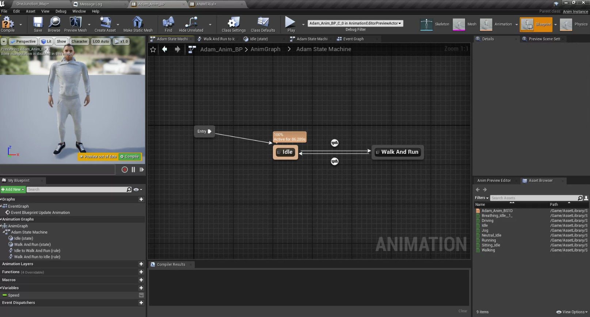

# Dynamic Pedestrians
## Version 1.0
### Modeler - Manasvi Kale

## 1. Summary
This Document aims at the creation of the pedestrian blueprints in alignment with the pedestrian manager module. These pedestrians blueprints depicts the human behaviour during simulation. They can walk on footpaths, crosswalks, follows traffic lights, and can perform diverse actions such as running, jogging, walking, standing idle, sitting, and driving vehicles. 

The asset library consists of 19 pedestrain assets and each of them has 6 animations respectively. 

## 2. Method
Dynamic Pedestrian module consits of 7 different components which requires to be set up independently inorder for the whole module to work properly. Refer the how to guide set these components in alignment with each other. 

Flowchart - 

## 3. Requirements
1. Character Skeletal Mesh
2. Character Animations
3. 1D Blend Space
4. Animation Blueprints
5. Nav Mesh 
6. Nav Mesh Modifier
7. Pedestrian Path Blueprints 

## 4. How-to-guide

### 4.1 Step 1 - Creating 1D Blend Space
  1. Step 1 - Create a 1D BlendSpace and name it “name_anime_BS”, while creating this select your character skeleton in it. 
  2. Step 2 - Inside Blendspace rename horizontal axis as “speed”
  3. Step 3 - Set max speed as 140
  4. Step 4 - Add breathing idle in the bottom grid followed by walking idle 4 times in the same grid.
  5. Step 5 - Save and close.

  

### 4.2 Step 2 - Creating AnimationBP for the same character.
  1. Step 1 - Create an animation Blueprint from the drop-down that pops up after clicking right in the content folder. 
  2. Step 2 - While you create AnimBP it will ask for a target skeleton, select your character skeleton in that.
  3. Step 3 - In anim graph add a new state machine, rename it to “charactername state machine”.
  4. Step 4 - Double click and open state machine 
  5. Step 5 - Take the arrow from entry and add a new state, rename it to idle.
  6. Step 6 - From idle state add a new state and rename it to walk. 
  7. Step 7 - Select transition node and set duration value to “0.5”. (For all the transition nodes)
  8. Step 8 - Open the states added in earlier (i.e idle and walk)
  9. Step 9 - Inside the idle state drag and drop idle animation from asset browser.
  10. Step 10 - Join the animation node to the output animation node.
  11. Step 11 - Now open walk state and drag and drop Blendspace that was created earlier
  12. Step 12 - Right click on speed and promote it to variable
  13. Step 13 - Now open idle to walk transition state

         13.1 Drag speed from variable and add float greater than node, put value 0 and join it to result node. 
  14. Step 14 - Open walk to idle transition drag speed variable in it, add float < float node and add value as 0.001, connect it with output.
  15. Step 15 - Open the event graph for animBP and add nodes shown in image below.

  Image insertion - event graph of animationBP

  16. Step 16 - Compile and save

  17. Step 17 - Finally, open the pedestrian BP , add this anim BP along with skeletal mesh and save it.

****

****

### 4.3 Step 3 -  Nav Mesh 
  1. Step 1 - Place nav mesh and scale it for the entire map and adjust it to be applicable only on all places pedestrians will move. 

### 4.4 Step 4 -  Nav Mesh Modifier
1. Step 1 -  If Nav mesh is covers the map including road as well. Put a Nav mesh modifier on the road and scale it, don’t cover crosswalks in it.

### 4.5 Step 5 -  Pedestrian Paths
1. Step 1 - The pedestrian path spline BP component is placed in the pedestrains folder. Place the spline and extend it throughout the map at all places where pedestrains are expected to spawn.

****