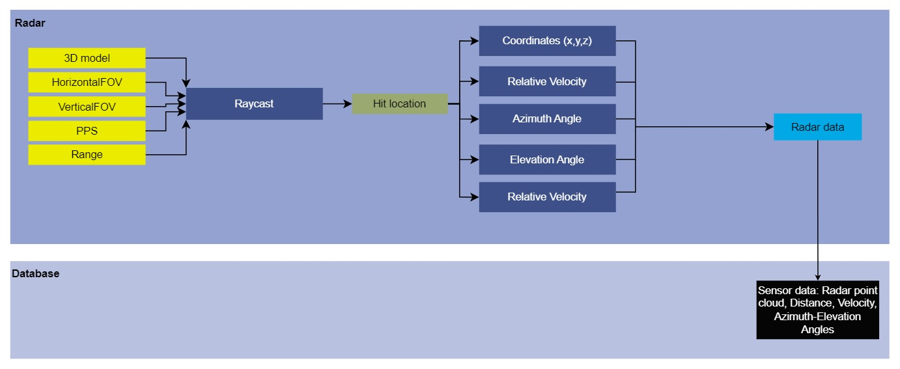

# Module Name
Radar
## Version
### Developer
Shirshakk Purkayastha

## 1. Summary
The Radar sensor is used to generate point sized rays using the input parameters of sensors {range, HorizontalFOV, VerticalFOV, and PulsesPerSeconds} to stimulate an automobile radar sensor.  It takes into account the FOV parameters (horizontal and vertical), creates a cone of view on this basis, uses raycasting to stimulate radar waves and provides the return information of the detected objects. The output includes the details of coordinates, range, relative velocity, azimuth and elevatiion angles of each hit.

## 2. Method
Using the input parameters of range, HorizontalFOV, and VerticalFOV, a cone of interest is created in front of the radar sensor. Within this cone, 'PPS' number of rays are fired uniformly in random (Ray Casting), taking into account the stimulation speed (FPS). Whenever the points touch down for the first instance within the range, a hit is generated by using the `LineTraceSingleByChannel` function of Unreal [read_more](https://docs.unrealengine.com/5.0/en-US/using-a-single-line-trace-raycast-by-channel-in-unreal-engine/). The hit is  stored in an `OutHit` data structure and corresponding details of [x,y,z], relative_velocity, azimuth_angle, vertical_angle, and range are then calcualted and stored into the OutHit structure.

### Data Flow Diagram:

### Radar attributes:

|Input Attributes| Type | Default Value | Description |
| ---------------- | --------------- | ------------------- | --------------- |
| `Range` | float | 20000 | Maximum distance to which the pulses can return back to the radar sensor after being fired|
| `HorizontalFOV` | float | 120 | Total coverage angle of the radar sensor in the horizontal plane |
|`VerticalFOV` | float | 30 | Toatl coverage angle of the radar sensor in the vertical plane |
|`PPS`|  int | 1500 | Pulses Per Second, denotes the number of pulses to be fired in one second|

|Output Attributes| Type | Description |
| ---------------- | --------------- | --------------- |
|`X`| float | X- coordinate of the point where the radar ray hits| 
|`Y`| float | Y- coordinate of the point where the radar ray hits|
|`Z`| float | Z- coordinate of the point where the radar ray hits |
|`velocity`| float | Relative velocity of the detected object |
|`azimuth_angle`| float | Horizontal angle of the detected object w.r.t. the radar|
|`elevation_angle`| float | Vertical angle of the detected object w.r.t. the radar |
|`range`| float | Distance of the detected object from the radar sensor|

### Output:
The [x,y,z] coordinates of the detection, along with relative velocity, range, and the corresponding horizontal and vertical angles of the detection, stored in the `Rays` data structure.

## 3. Requirements
The super file containing the details of each sensor (Sensor.h).
