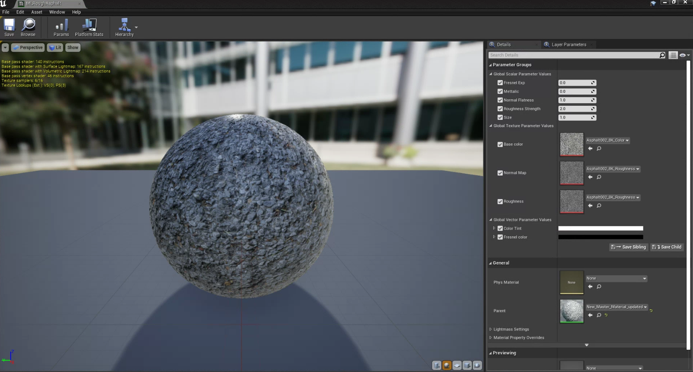
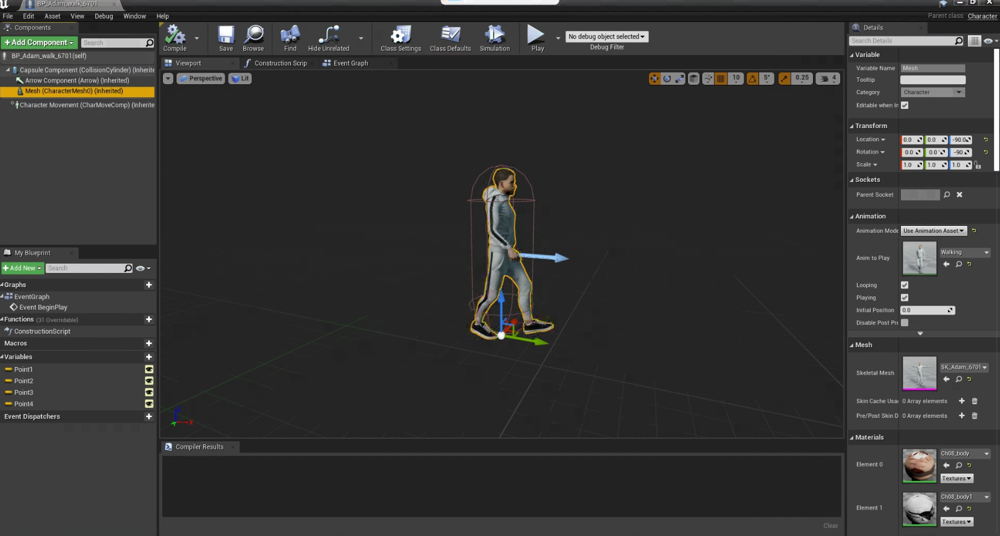

# Tool Summary
## Version 1.0
### Developer - Manasvi Kale

## 1. Summary
The tool summary is a collective guide that instructs downloading, creating and modifiying and storage of assets such that they are compatible for any type of sensor data generation in limulator. 

## Asset Library

## 1. Method
Asset Library is a folder structure inside limulator software which was deliberately created for the storage of 3D models which can be directly used to populate environment for sensor data generation. 

Refer the flowchart below for the folder sturcture of library.   

## 2. Requirements
1. Folder Structure 

## 4. How-to-guide 
The asset library was created and comes installed along with limulator software. The folder structure is not to be altered by any user or third-party as it is directly linked with the segmentation and dectection of objects when scenario runs in simulation. Any changes in structure will lead to incorrect output for semantic camera images in the data. 

****
## Naming Convention For Assets 

## 1. Method

The naming convention guide is created to name assets and their respective materials such that they are in alignment with sensor data generation and intensity visualition. The naming convention is was created in collaboration of SOP for lablelling document, parameters required and standards followed in modeling industry.  
 
Refer the country specific naming convetion and examples for understanding. 

## 2. How-to-guide 

The table below provides a country specific abbreviation that is to be written in prefix of asset name. 

1. India: IN 
2. United States of America: US 
3. United Kingdom: GB 
4. Canada: CA 
5. Australia: AU 
6. Germany: DE 
7. France: FR Japan: JP 
8. China: CN 
9. Brazil: BR 
10. Russia: RU 
11. South Africa: ZA 
12. Italy: IT 
13. Spain: ES
14. Mexico: MX 
15. Argentina: AR 
16. New Zealand: NZ 
17. Sweden: SE 
18. Switzerland: CH 
19. Netherlands: NL 
20. Belgium: BE 
21. Norway: NO 
22. Singapore: SG 
23. Malaysia: MY
24. Indonesia: ID

#### 3. Naming Convention 
The naming of assets and materials is demonstrated through examples below. 

#### 3.1 Assets 
"SM_Countrycode_Assetname_instanceid_SOPLabel
 
 example -  IN_building_01_061

#### 3.1 Materials and Instances
"M_type_assetname_instanceid_part_partinstaceid"
"MI_materialtype_assetname"

example - 
1. M_Steel_ElectricPole_01
2. MI_Steel_ElectricPole_01

****

## Master Material & Instances

## 1. Method
 The objective of master materials and their instances is to create a base template with material properties of roughness, strength, metallic, base color, normal, and size. And to implement it on texture images for object material creation.

## 2. Requirements
1. Texture images 

     1.1 base color

     1.2 normal map 

     1.3 roughness.

## 3. How-to-guide 
Nodes for properties are connected and default values are set. 
Master material is saved and material instances are created.

### 3.1 Step 1 - Material graph 
1. Material graph is created by initializing the master material inside the unreal engine.
2. Connect the texture nodes with each other and leave it to their default properties.

### 3.2 Step 2 -  Material Instance
1. After saving material, create a material instance for the same material in content browser by write clicking on the material 

## 4. Tutorials

Master Material - 

Material Instance - 

****
## Dynamic Pedestrians

## 1. Method
The aim is to create a Dynamic pedestrian blueprint which will be able to simulate different behaviours in a certain areas on the map.  

## 2. Requirements
1. Character Skeletal Mesh
2. character Animations
3. Material Blueprints
4. Character Blueprints

## 3. How-to-guide

### 3.1 Step 1 - Character Blueprints
1. Import the skeletal mesh of the character.
2. Import the character animations in the same folder.
3. Create a charcater blueprint and the name is “BP_nameofcharacter”. 
4. Add the imported animation to the blueprint of the character.
5. Go to the event graph add the “AIMoveTo” node with the event begin to play, add a self-pawn actor, and create a destination variable. (These destination variables can be used to identify the locations on which pedestrians will move).
6. Add as many AIMoveTo nodes as many location input you would like user to input. 
7. Refer the event graph image to connect the nodes. 
8. Insert a nav mesh to the map and expand it throughout the map. 
9. Apply and save BP. 

## 4. Tutorials

 

****

