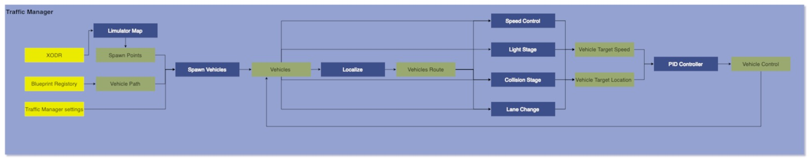

# Traffic Manager
## Version
### Developer

## 1. Summary
This module is designed to control the vehicles and traffic in simulation. This modules ensures that vehicles in simulation follows traffic rules. This modules manuvers the vehicles in simulation without any collision.  

## 2. Method
When the simulation starts first of all spawn points are calculate as per seed value on provided XODR. Once spawn points are generated vehicles stored in asset libraray are randomly spawned on points. After spawning a vehilcle it is initalised by its current route, default speed, haltDistanceFromFrontVehicle, tailgateDistance, emergencyHaltDistance, signalStoppingDistance , laneChangeProbability and boundingboxExtends. All the parameter are calculated randomly by gaussin distribution over mean and deviation value of respective variable. After all vehicles are iniitalised they starts manuvering on their current route. Now to control vehicles and to make them follow traffic rules different functions are callled, for example to control vehicles speed, `Speed control` function is called which controls the speed to vehicles speed according to vehilce position and position of other vehicles. There is `Light stage` funcion which ensures that vehicles follow traffic light rule. There is `Collsion stage` function which manages the junctions that has no traffic lights, it insures that there should no collision between the vehicles when passing through this junction. Then there is `Lane change stage` function which is responsible to make a vehicles lane change without any collision. These all function follows some rules to perforn all the actions. The rules for every function is listed below-
 

**Spawining of vehicles** 
1. The total number of spawnable points is calculated for a map based on a variable average distance $d$ with a random offset. 
2. Each spawn point is located at a distance of $d$ (currently set at 15m) from the starting point of the road.
3. Spawn points are determined only within the driving lanes.
4. Lanes with a width less than 2m will not generate any spawn points.
5. The heading of spawn points is set according to the rule of the road.
6. Spawn points are not generated within junctions.
7. Spawnable points are shuffled using a random seed provided by the user. Thus, for a given seed, the spawn points will be deterministic. For perfect randomization, the seed "time" can be used. 
8. The first $n$ spawn points are selected from the available spawnable points based on the number of vehicles specified..  
9. For any given road point, a lane is randomly chosen. Additionally, no two spawn points will lie parallel on lanes.
10. If the number of vehicles is greater than the available spawn points on the map, then the simulation stops. In other words, the number of vehicles must be less than or equal to the number of spawn points available.
 

**Speed Control**
1. Vehicle speed is adjusted accordingly when anticipating a turn or approaching a junction. 
2. At junctions, the maximum speed of vehicles is set to 20 km/h, while at turns it's calculated using the formulae: $\sqrt(\mu * g / \left|\text{Curvature}\right|) * 3.6) - 6.0$ where $ \mu $ is cofficient of friction $g$ is acceleration due to gravity, $curvature$ is the curvature of road at that point. 
3. If a vehicle is traveling at a lower speed in front, the following vehicle adjusts its speed to maintain a safe tailgate distance between them.
4. Vehicles in junctions are not considered as vehicles in front; it's assumed that junction-specific rules apply, and collisions are avoided.
5. When encountering a stopped vehicle ahead, the vehicle stops before reaching a minimum distance from the stopped vehicle.
6. In the presence of any obstruction ahead, other than a moving vehicle in the lane (e.g., a horizontally parked vehicle), an emergency brake is applied.
7. The vehicle's speed is decreased by a decleration of $\frac{{v^2 - u^2}}{{2d}}$, where where $v$ is the final speed and $u$ is the initial speed, over a distance $d$. 
 

**Lights Stage**
1. At a traffic light junction, vehicles follows the traffic light signals.
2. If the light is red or yellow, the vehicle stops at a given distance from the traffic light. 
3. Only the first vehicle in the lane stops by the influence of the traffic light, subsequent vehicles stop because the vehicle in front is stopped.
4. The vehicle only starts moving when the light is green. 
5. Once the vehicle is inside the junction, it’ll continue moving even if the light has switched to red. This is to avoid the deadlock.   
6. Vehicle senses traffic light not with a camera or any kind of perception but rather it mathematically calculates the distance and checks the heading between the vehicle and the light.
Condition: Distance < 100m / Light Influence Distance && they must face each other && vehicle must come before the light in this facing. 
 

**Collsion Stage**
1. Multiple vehicles are allowed in the junction simultaneously.
2. Every vehicle in the junction checks its collision with other vehicles at the junction.
3. Vehicles that cannot collide with each other are allowed to pass through the junction.
4. Vehicles passing through the junction are randomly selected from a set of non-colliding vehicles. 
5. Once a vehicle enters the junction it must continue moving without stopping within the junction.
6. It’ll cause a deadlock if a vehicle for some reason fails inside the junction. 
 

**Lane Chane Stage**
1. Vehicle will only change lanes if the destination lane is a driving lane and its width is greater than 2m. 
2. Vehicles don't change lanes while in a junction.
3. If Vehicle has both the left lane or right to choose, it chooses randomly between the left lane and right lane. 
4. Every vehicle calculates its safe lane change distance based on their speed. The estimate is very crude and calculated by trial and error. 
5. Based on safe distance vehicles see its back and front and check if lane change is safe or not, if safe then only do lane change.
6. If a junction is occuring in the safe distance checking it’ll reject the lane change. 
7. All the checking before the start of the maneuver. Once the lane change is started, no additional checking is done and it can’t be stopped in between. This may lead to a scenario where a vehicle is blocking both the lanes because speed restriction came into play. To circumvent this, a persistent checking can be done which can cancel the maneuver in between if deemed so. 
8. If lane change is assigned then, its current waypoints are scrubbed and a list of waypoints is generated starting the safe distance in the changing lane. PIDs are responsible for maneuvering and straightening. 
9. Every time a lane change happens a small offset gets applied to the vehicle i.e. if the vehicle was moving in the center then after changing the lane it’ll stabilize a little off the center. 

**Traffic Manager General Rules**
1. If an obstacle, such as a parked vehicle, obstructs the corner of a lane, approaching vehicles will come to a complete stop rather than attempting to navigate around it with a slight turn.
2. If a vehicle comes to a stop in the middle of the road due to a failure or for any other reason, approaching vehicles will also stop rather than overtaking the stationary vehicle.
3. Any vehicle out from the road for more than 1 second will be destroyed and removed from the map.

### Traffic Manager attributes

| Input attribute  | Type   | Default    | Description     |
| ----------------------------------------------------------------- | ----------------------------------------------------------------- | ----------------------------------------------------------------- | ----------------------------------------------------------------- |
| `vehicleCount` | int    | 20  | Number of vehicles to spawn.    |
| `randomSeed`| int  | 1 | .       |
| `defaultSpeedMean`            | float  | 60.0  |Mean Default speed of vehicles.      |
| `defaultSpeedDeviation`            | float  | 5.0  | Deviation from the default mean speed.  |
| `haltDistanceFromFrontVehicleMean`        | float  | 5.0 | Mean halt distance from the front vehicle.         |
| `haltDistanceFromFrontVehicleDeviation`        | float  | 1.0  | Deviation from the mean halt distance        |
| `tailgateDistanceMean`     | float  | 10.0 | Mean tailgate distance. |
| `tailgateDistanceDeviation`     | float  | 1.0  | Deviation from the mean tailgate distance. |
| `emergencyHaltDistanceMean`     | float  | 2.0 | Mean emergency halt distance from the front vehicle. |
| `emergencyHaltDistanceDeviation`     | float  | 0.5   | Deviation from the mean emergency halt distance |
| `signalStoppingDistanceMean`     | float  | 7.0 | Mean stopping distance from the signal. |
| `signalStoppingDistanceDeviation`     | float  | 1.0   | Deviation from the mean stopping distance from the signal. |
| `laneChangeProbabilityMean`     | float  | 0.002 | Mean lane change probability. |
| `laneChangeProbabilityDeviation`     | float  | 0.0001   | Deviation from the mean lane change probability. |
| `maxThrottle`     | float  | 0.85 | Maximum value of vehicles throttle. [0,1] |
| `maxBrake`     | float  | 0.3   |  Maximum value of vehicles brake. [0,1] |
| `maxSteer`     | float  | 0.8 |  Maximum value of vehicles steer. [0,1] |
| `baseMinDistance`     | float  | 2.0   | Minimum distance for forward waypoint. |

## 3. Requirements
1. Unreal Engine 
