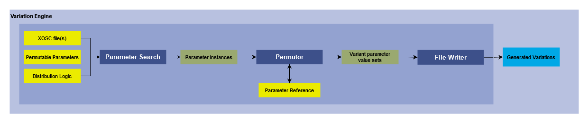

# Variation Engine

## Version 1.0

### Developer: Marut Priyadarshi

## 1. Summary
This module takes OpenScenario files as input and, using a parameter reference database of supported parameters, generates variations of the input xosc file, one at a time or in bulk.

## 2. Method



### 2.1 Inputs
  The user makes a number of selections before executing the module:
  1. Selecting the OpenScenario file, multiple files or a folder containing multiple OpenScenario files.
  2. Selecting from a list of available options, the parameters which will be permuted when generating variations.
  3. Selecting the type of distribution logic for the permutation of numeric parameters.
      + Dense: The parameter is uniformly distributed in the range of +/-10% of the original parameter value.
      + Sparse: The parameter is uniformly distributed in the maximum range defined in the reference database for that category of parameter.

### 2.2 Parameter Search

  Based on the user input, the module searches the xosc file for the selected parameters.
  There are different functions for searching and handling the parameters based on their datatype and values:
  1. ```speedSearch()```: This searches for instances of initial speed parameters of vehicles.
  2. ```bodyChange()```: This searches for vehicle model parameters.
  3. ```accelChange()```: This searches for the acceleration parameters.
  4. ```decelChange()```: This searches for deceleration parameters.
  5. ```laneChangeSpeed()```: This searches for the parameter which defines the duration of the lane change action.

  When the module encounters an instance of the selected parameters, it calls the ```permuteNum()``` or ```permuteStr()``` function to generate permutations. Then it continues the search for the next instance of the selected parameters.


### 2.3 Parameter Reference
  We have created a database which contains the supported parameters on which permutations can be performed, the permissible ranges for those parameters (eg: speed, acceleration) and different range of values for categories of vehicles. 

  Currently, different categories of vehicles (cars, trucks) get generic values for their cateegory parameters. Future support for different values for each vehicle model is planned.

  This database is referenced by the permutation module while generating variations to define the ranges for the numerical valued parameters.

### 2.4 Permutor:
 After encountering an instance of the parameter in the search, the module cross-references it with the Parameter Reference and depending on the distribution logic input by the user, it generates variations of the scenario by permuting the current parameter. The function used is dependent on the datatype of the parameter
 1. ```permuteNum()```handles the permutation of numeric valued parameters (integer, float, double)
 2. ```permuteStr()```handles the permutation of string valued parameters.

 Before completing an execution cycle, the function resets the parameter value to its original value before giving the control back to the parameter search module.


### 2.5 File Writer:
  The permutor module calls the ```write()``` module to continously write the generated permutations into new xosc files, generating the variations of the input xosc file(s)

## 3. Requirements
- Python 3.10