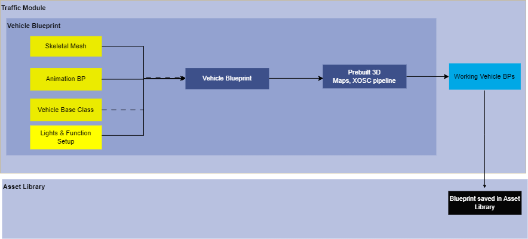
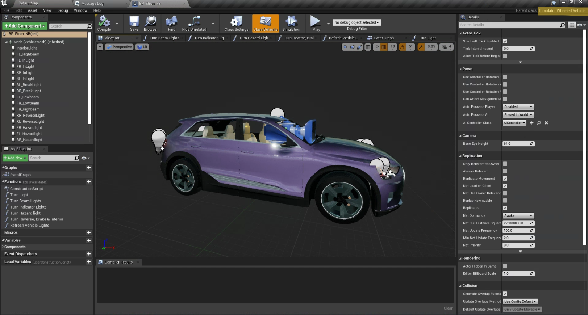
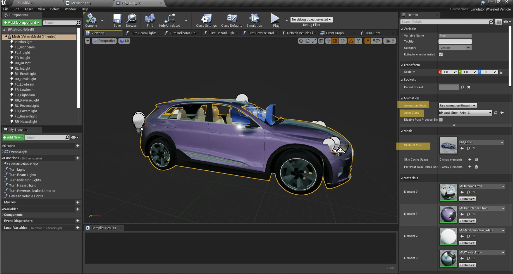
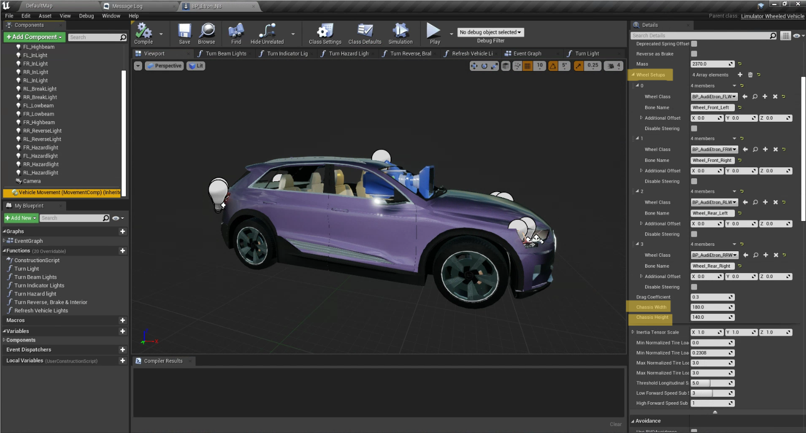

# Vehicle Blueprints
## Version 1.0
### Modeler - Manasvi Kale

## 1. Summary
This document helps you create a Vehicle blueprint equipped with vehicle lights which are in alignment with vehicle controller.

## 2. Method
Vehicle Blueprint deriving from "limulatorwheeledvehicle" base class inherits all the base properties and functions of a vehicle. Vehicle lights are placed at relevant positions with relevant intensity values. These Blueprints are spawned in raod map at run time in simulation.  

Refer How-to-guide to set up all the required compoents for vehicle blueprints. 

flowchart - 

## 3. Requirements
1. Vehicle Skeletal Mesh
2. AnimationBP for Vehicles
3. Front and Rear Tyre Blueprints
4. LimulatorWheeledVehicle Base class 
5. SimpleLimulatorWheeledVehicle Base class

## 4. How-to-guide

### 4.1 Step 1 - Creating Vehicle Blueprint

1. Step 1 - Create BP and inherit it from “LimulatorWheeledVehicleBase” and name it as per vehicle model.
2. Step 2 - Add the vehicle skeletal mesh and relevant animation BP to it.
3. Step 3 - Select Vehicle Movement Component.

         3.1 Inside vehicle set up heading add mass.

         3.2 In the Wheel setups add front and rear wheels and wheel class.

         3.2 Add chassis width and chassis height as per your car model.
4. Step 4 - All the inherited lights are to be adjusted at their respective places as per the model. (i.e headlights, brake lights, indicator etc) 

The radius for lights will change for each vehicle model. Adjust that as well.

5. Step 5 - Copy all the blueprint functions from the base class blueprint and paste it in the new BP.

6. Step 6 - Open event graph of the vehicle.

7. Step 7 - Add “Event refresh lights” node and add refresh vehicle lights and connect them. Also join “in lights state” to “vehicle lights state”.

8. Step 8 - Apply and save.

* Vehicles created with "LimulatorWheeledVehicleBase" are used simulation in pre-built maps. 
* Steps for creating vehicles for XOSC pipeline are all same mentioned above. The base class however changes to "SimpleLimulatorWheeledVehicle". 

## 5. Tutorial 

****

****

**** 