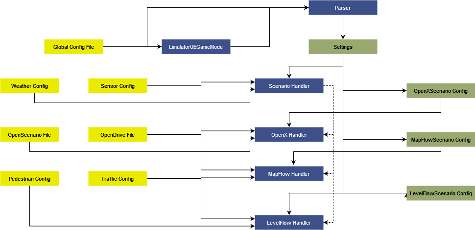

# Game

## 1. Summary
The Game module is responsible for overseeing the entire simulation, serving as a central coordinator for other modules. It extends global support to all modules, facilitating seamless coordination. Acting akin to a manager overseeing a team, the Game module assigns tasks to other modules and captures their outputs, ensuring effective collaboration and functioning across the simulation.

## 2. Method

### 2.1 Scenario Handlers
Scenario Handlers define an abstract class for handling different sensor data generation pipelines. Briefly, it attaches sensor to ego, manages environment and handles ticking of the simulation. 

#### 2.1.1 OpenX Handler
OpenX handler is responsible for simulating OpenX scenarios. This handlers acts as a bridge between the core and the simulation, updating entity position and adding the sensors. 

#### 2.1.2 MapFlow Handler
Mapflow handler generates stochastic simulation using the auto traffic functionality over custom files. Inputs to this are the map HD file and configuration for auto traffic. The aim for this pipeline is to generate a random city like traffic simulaiton. 

    Note: Simulation using auto-traffic can't be resimulated exactly even when given the same seed. 

#### 2.1.3 LevelFlow Handler
This is quite similar to MapFlow scenario. It's differentiates MapFlow scenario with two things: it adds functionality of intelligent pedestrians in the simulation, it runs of pre-made level which includes with HD Map an static 3D environment. 

    Note: Simulation using auto-traffic can't be resimulated exactly even when given the same seed. 

### 2.2 Parser 
Parser is responsible for reading the configuration file given to the limulator. It reads the file, checks for correctness and finds the appropriate scenario handler to be used.  

### 2.3 Annotator
Annotator is reposible for annotating all the actors in the evironment or newly spawned actors. This annoation is of great help in the semantic segmentation.  

### 2.4 Actor Factories 
Actors factories follow the simple factory design. All objects spawned in the simulation must go through the actor factory. This helps us in making sure that all objects are annotated and initializations are done properly. 

### 2.5 Blueprint Registries
Blueprint Registry brings the bluerprints created in asset library for use in our limulator. Every vehicle, pedestrian, or other dynamic must be added to the registry. 

### 2.6 Level Opener & Game Modes
Every simulation has certain fundamentals, like controller entity (in our case they're scenario handlers), transition between levels, etc. These fundamental concepts and rules are defined by GameMode. We call our custom Game mode LimulatorUEGameModeBase. 

    Note: This is the entry point after starting the game. It handles the creation of parser and then spawning the approriate scenario handler. After that, it passes control to the scenario handlers.  
