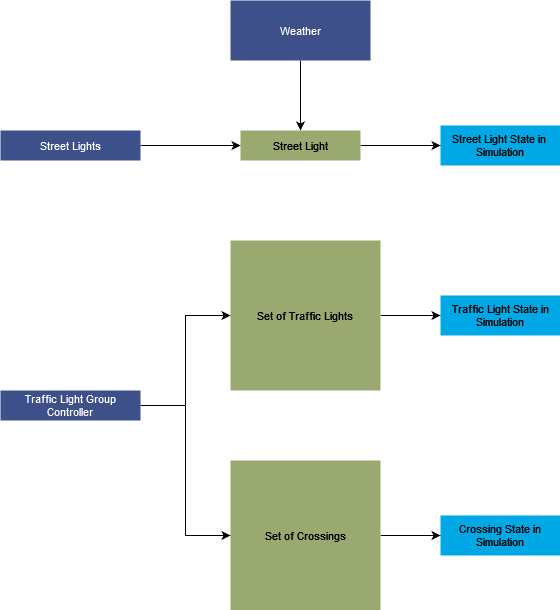

# Lights
## Version 1.0
### Developer

## 1. Summary
Lights module is responsible for controlling the behaviour and display of lights in the simulation environment. It is intergrated with the weather module in an observer pattern. Lights are autonomously controlled with weather. 

## 2. Method

### 2.1 Street Lights 
All street lights in the simulation are derived from a common street light base class. It provides a simple interface which is mostly about turning on/off. 

### 2.2 Stand-alone Traffic Lights 
Traffic lights are kept aside from their logic. It has two components: a traffic light class, which provides an interface of turning on/off. The interface is further implemented by the concrete blueprint classes. It's logic is encapsulated in controllers. Controllers control the current state of a traffic light and changes is appropriately. 

Two types of controllers are implemented -- for single lights and for a complete group at junctions. 

### 2.3 Crossings
Crossings form an important part of the traffic network. They are deeply integrated with the traffic lights to control the flow of pedestrians. Crossings have a state of their own which allows or rejects the flow of pedestrians. It's state is either always allowing or is governed by the attached traffic light.   

## 4. How-to-guide
[How to add a new Street Light](LightsModelling.md#street-lights)

[How to add a new Traffic Light](LightsModelling.md#4-how-to-guide)

[How to add a new Crossing](LightsModelling.md#4-how-to-guide)

[How to add a new Traffic Light Group Controller](LightsModelling.md#4-how-to-guide)