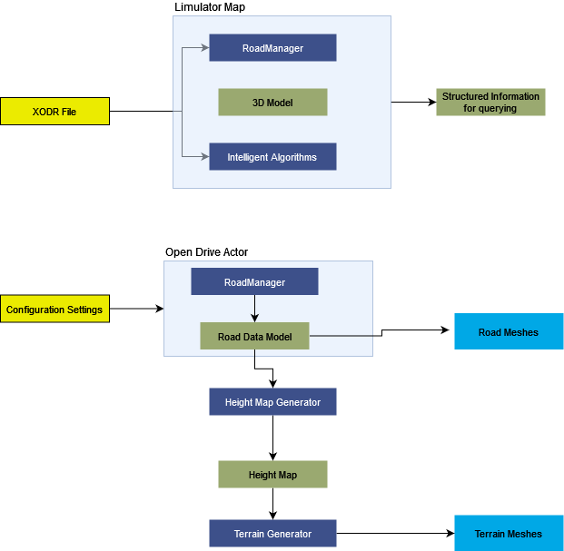

# Map
## Version 1.0
### Developer

## 1. Summary
The Map module encapsulates the 3D model of the environment, incorporating a structured HD map for the road. The HD Map adheres to the OpenDrive standard (refer to the ASAM website for details). Additionally, the Map module offers various intelligent functionalities, including automated terrain generation, intelligent abstract queries on the HD Map, and navigation point generation.

Limulator Map heavily relies on the road manager provided by esmini, which handles most of the substantial tasks. However, it also incorporates the additions done by the map creator (e.g. addional traffic signs, lights)
and its own intelligent algorithms to process data supplied by the road manager.

While Limulator Map is intricately woven into the Limulator project, an external shared library is available for querying the map, albeit with some limitations.

There's also an autnomous terrain generator capable of generating a terrain that aligns with the road definition of HD Map. It is very useful in creating the illusion of real world while running OpenX simulations. 

## 2. Method

### 2.1 Limulator Map 

### 2.2 Terrain Generator   

## 3. Requirements
